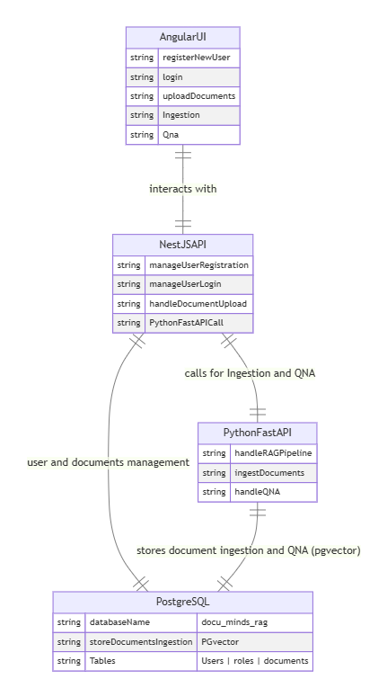

# DocumindRAG

DocumindRAG is a full-stack Retrieval-Augmented Generation (RAG) application designed for document ingestion, embedding generation, and question-answering. It consists of three main components:
- **Python Backend**: Handles document ingestion, embedding generation, and RAG-driven Q&A.
- **NestJS Backend**: Manages user authentication, document management, and ingestion controls.
- **Angular Frontend**: Provides a user-friendly interface for authentication, document management, ingestion monitoring, and Q&A.

The system leverages modern tools and libraries to ensure scalability, modularity, and performance, with a microservices architecture for seamless interaction between components.
  
  

## Features

### Python Backend
- **Document Ingestion**: Accepts document data, generates embeddings using a Large Language Model (LLM), and stores them in a Postgres(pgVector) database.
- **RAG-based Q&A**: Retrieves relevant document embeddings and generates answers using a RAG pipeline. Users can only search their own documents, while admins have access to all documents.
- **Caching**: Uses LangChain's in-memory cache for LLM responses to optimize performance.
- **Asynchronous Processing**: Handles API requests efficiently using async programming with FastAPI.

### NestJS Backend
- **User Authentication**: Supports registration, login, logout, and role-based access using JWT.
- **User Management**: Admin-only APIs for managing user roles and permissions.
- **Document Management**: CRUD operations for document upload and management.
- **Ingestion Control**: Triggers and monitors document ingestion in the Python backend via API calls .

### Angular Frontend
- **Authentication Interface**: Pages for sign-up, login, and logout.
- **Document Management**: Interface for uploading and managing documents.
- **Ingestion Management**: Monitors and triggers document ingestion processes.
- **Q&A Interface**: Allows users to ask questions, view answers, and see relevant document excerpts.
- **Responsive Design**: Ensures compatibility across devices and browsers with modular, reusable components.

## Architecture

- **Python Backend**: Built with FastAPI for asynchronous API handling, LangChain for RAG, and Postgres for embedding storage.
- **NestJS Backend**: Uses TypeScript and a microservices architecture, integrating with Postgres for user and document data.
- **Angular Frontend**: A modular, component-based UI that communicates with both backends via REST APIs.
- **Inter-service Communication**: The NestJS backend triggers ingestion in the Python backend using API calls.

## Prerequisites

- **Python Backend**:
  - Python 3.8+
  - Postgres database
  - OpenAI API key (for LLM)
  - Required packages: `fastapi`, `langchain`, `langchain-openai`, `sentence-transformers` (optional), `psycopg2`
- **NestJS Backend**:
  - Node.js 16+
  - Postgres database
  - Required packages: `@nestjs/core`, `@nestjs/jwt`, `@nestjs/typeorm`
- **Angular Frontend**:
  - Node.js 16+
  - Angular CLI 16+
- **General**:
  - Docker (for postgress setup)
  - Git for version control

## Installation

1. **Clone the Repository**:
   ```bash
   git clone https://github.com/yourusername/documindrag.git
   cd documindrag
   ```

2. **Set Up Python Backend**:
   
   - rename file `.env.example` to `.env`
   - update API Keys

3. **Set Up NestJS Backend**:
   [NestJS + Prisma + PostgreSQL Setup Guide](nestjs-user-management\README.md)

4. **Set Up Angular Frontend**:
   ```bash
   cd docu-mind-ui
   npm install
   npm run start
   ```
   - Configure API endpoints in `src/environments/environment.ts`:
     ```typescript
     export const environment = {
       production: false,
       apiBaseUrl: 'http://localhost:3000'
     };
     ```

5. **Run the Application**:
   - **Python Backend**: `python app.py`
   - **NestJS Backend**: `npm run start`
   - **Angular Frontend**: `npm run start`


